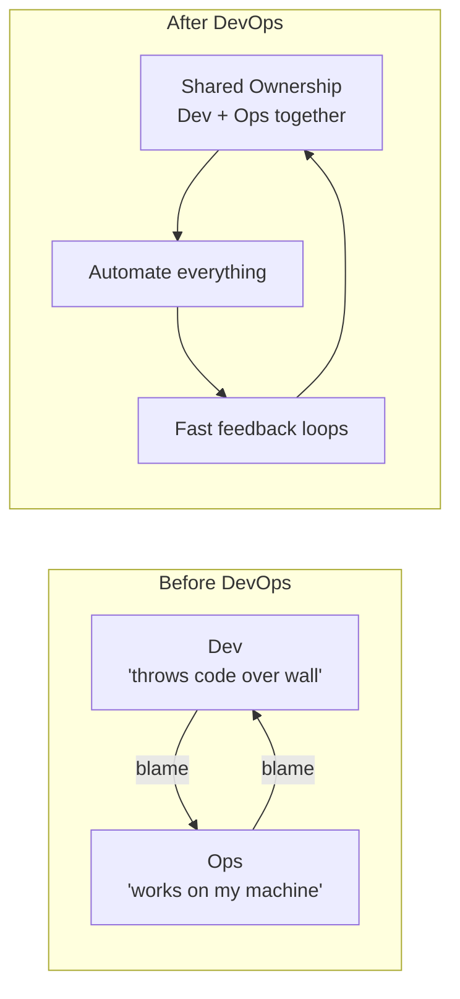
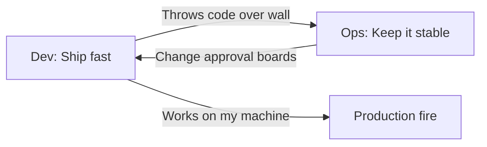
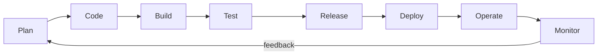
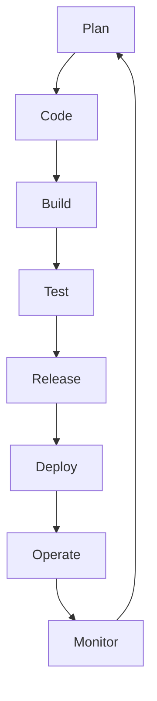

# What Is DevOps

## The Problem DevOps Solves

Development teams ship code fast. Operations teams keep systems stable. These goals conflict.

The result: slow releases, blame cycles, broken production.

## DevOps Definition

DevOps is not a tool or a team. It is **culture + practices + tools** that break down the wall between development and operations.

- **Culture** — shared ownership of production, blameless collaboration
- **Practices** — CI/CD, infrastructure as code, automated testing
- **Tools** — Git, Docker, Kubernetes, Prometheus, Terraform

## CALMS Framework

The maturity model for DevOps adoption:

| Dimension | Meaning | Example |
|-----------|---------|---------|
| **C**ulture | Trust, shared responsibility | Devs carry pagers |
| **A**utomation | Eliminate manual toil | CI pipeline runs tests on every push |
| **L**ean | Small batches, fast feedback | Deploy hourly, not monthly |
| **M**easurement | Data-driven decisions | Track deployment frequency, MTTR |
| **S**haring | Open knowledge flow | Postmortems published to all |

## Key Metrics (DORA Four)

High-performing teams measure:

1. **Deployment Frequency** — how often code deploys to production
2. **Lead Time for Changes** — commit to production
3. **Change Failure Rate** — percentage of deployments causing failures
4. **Mean Time to Recover (MTTR)** — how fast you fix what breaks

These metrics reveal whether your process works, not whether your tools are trendy.

## The Feedback Loop

Every stage feeds the next. Speed through the loop = faster learning = better software.

## What DevOps Is Not

- A job title you assign to one person while everyone else works the old way
- Buying Jenkins and calling it done
- A separate "DevOps team" that becomes a new silo

DevOps succeeds when the entire organization optimizes for fast, safe delivery.
