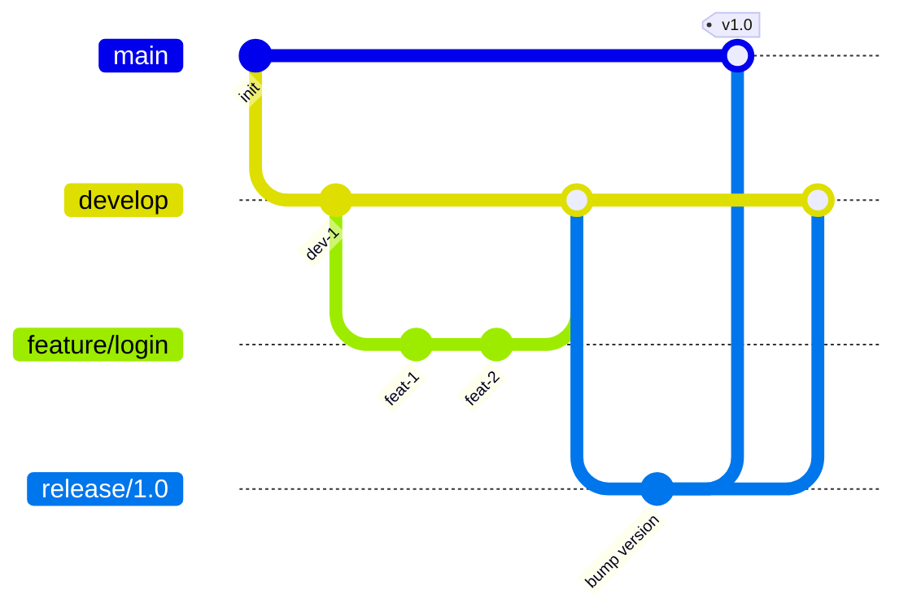
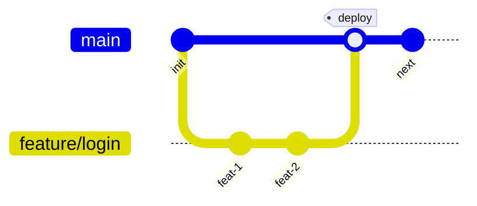
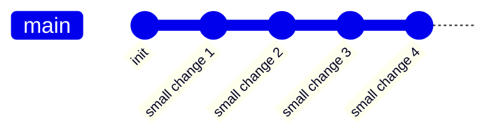

# Git Workflows `[Entry]`

## Why Branch Strategy Matters

Your branching model determines how fast you can ship and how often you merge. The wrong model creates bottlenecks: long-lived branches, painful merges, delayed releases.

## Git Flow



**Structure:** `main` (production), `develop` (integration), `feature/*`, `release/*`, `hotfix/*`

**When to use:** Scheduled releases (weekly/biweekly), strict versioning requirements, teams that need release stabilization windows.

**Tradeoff:** Complex. Multiple long-lived branches. Merge conflicts accumulate on `develop`.

## GitHub Flow



**Structure:** `main` (always deployable), short-lived feature branches, PR for every merge.

**When to use:** Continuous deployment, small teams, SaaS products that deploy multiple times daily.

**Tradeoff:** No release stabilization. Every merge to `main` goes to production (you need strong CI).

## Trunk-Based Development



**Structure:** Everyone commits to `main` (or very short-lived branches < 1 day). Feature flags control incomplete work.

**When to use:** High-performing teams with mature CI/CD, feature flag infrastructure, strong test coverage.

**Tradeoff:** Requires discipline. Feature flags add complexity. Not suitable for teams without automated testing.

## Comparison

| Aspect | Git Flow | GitHub Flow | Trunk-Based |
|--------|----------|-------------|-------------|
| Branch lifetime | Weeks | Days | Hours |
| Release cadence | Scheduled | On merge | Continuous |
| Complexity | High | Low | Low (but needs CI maturity) |
| Merge conflicts | Frequent | Rare | Minimal |
| Requires feature flags | No | Optional | Yes |

## Choosing a Workflow

```yaml
# Decision guide
if:
  team_size: "< 10"
  deployment_cadence: "continuous"
then:
  workflow: "GitHub Flow"

if:
  release_model: "scheduled"
  regulatory_requirements: true
then:
  workflow: "Git Flow"

if:
  ci_maturity: "high"
  test_coverage: "> 80%"
  feature_flags: true
then:
  workflow: "Trunk-Based Development"
```

## Rules That Apply to All Workflows

1. **Never commit directly to `main`** in a team setting — use PRs
2. **Delete branches after merge** — stale branches create confusion
3. **Keep branches short-lived** — the longer a branch lives, the harder the merge
4. **Rebase frequently** from `main` to catch conflicts early
5. **Protect `main`** — require passing CI, require review, forbid force push

```bash
# Protect main branch (GitHub)
gh api repos/:owner/:repo/branches/main/protection \
  -f required_status_checks='{"strict":true,"contexts":["ci/test"]}' \
  -f enforce_admins=true \
  -f required_pull_request_reviews='{"required_approving_review_count":1}'
```
