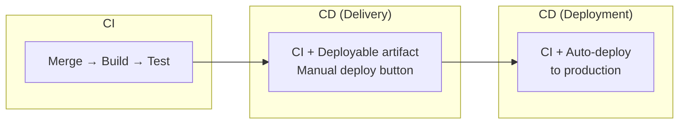
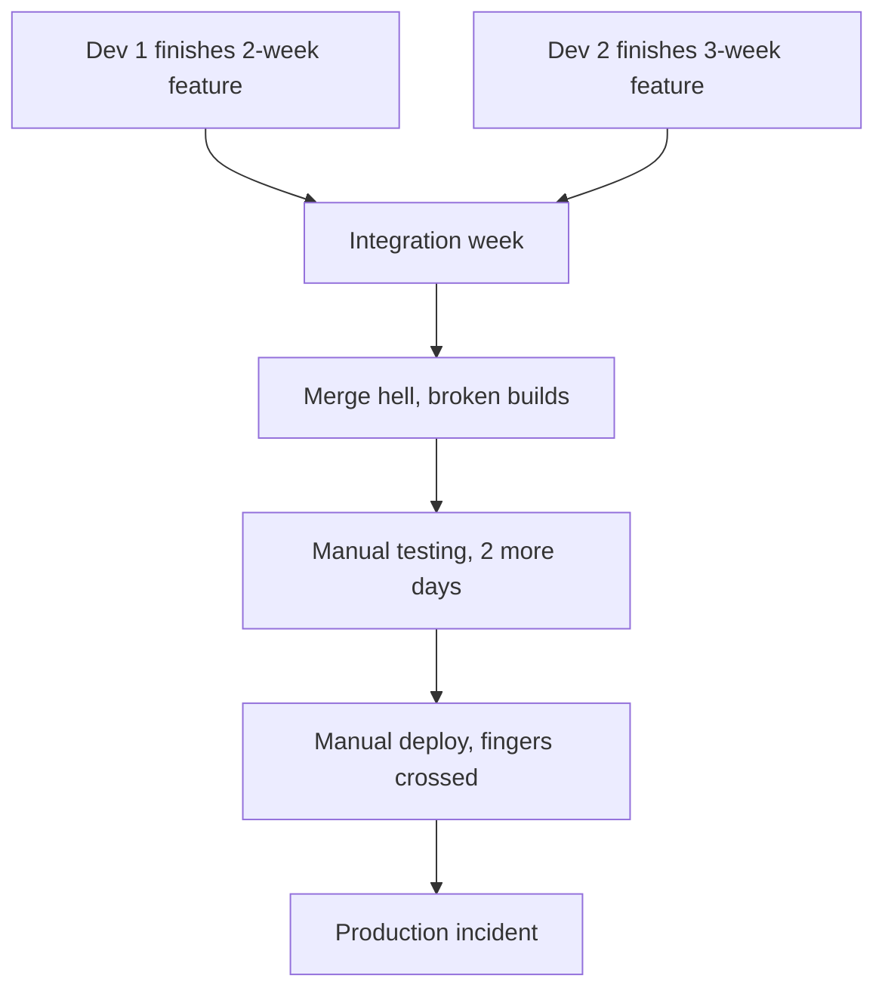
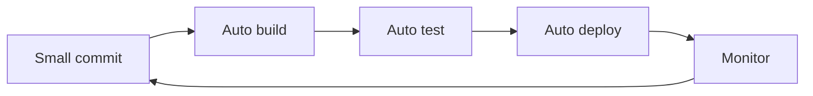

# What Is CI/CD

## Three Terms, Three Meanings




**Continuous Integration (CI):** Every merge to `main` triggers an automated build + test pipeline. If tests fail, the merge is rejected. Integration problems are caught in minutes, not days.

**Continuous Delivery:** Every successful CI run produces a deployable artifact. One manual approval separates your code from production. You can deploy at any time.

**Continuous Deployment:** Every successful CI run deploys to production automatically. No human approval. Requires extreme confidence in tests and monitoring.

```yaml
# The progression
CI:       commit → build → test
Delivery: commit → build → test → artifact ready → manual approval → deploy
Deployment: commit → build → test → artifact → auto-deploy to production
```

## Why CI/CD

Without CI/CD:



With CI/CD:



Small batches, fast feedback, automated everything.

## The Pipeline

```yaml
# Conceptual pipeline
pipeline:
  stage_1_build:
    - install dependencies
    - compile code
    - build docker image

  stage_2_test:
    - run unit tests
    - run integration tests
    - run linting

  stage_3_security:
    - scan dependencies for vulnerabilities
    - scan container image

  stage_4_artifact:
    - push image to registry
    - tag with git sha

  stage_5_deploy:
    - deploy to staging
    - run smoke tests
    - deploy to production
```

Every stage must pass before the next runs. If any stage fails, the pipeline stops and the team is notified.

## Key Principles

1. **Build once** — compile/package once, promote the same artifact through environments
2. **Test early** — fast unit tests first, slow integration tests after
3. **Fail fast** — stop the pipeline on first failure
4. **Every commit triggers the pipeline** — no manual builds
5. **Artifact immutability** — never modify a built artifact, build a new one

## CI/CD Tools

| Tool | Type | Use Case |
|------|------|----------|
| GitHub Actions | Cloud CI | Open source, GitHub-hosted projects |
| GitLab CI | Self-hosted/Cloud | GitLab users, Kubernetes runners |
| Jenkins | Self-hosted | Enterprise, complex pipelines |
| CircleCI | Cloud CI | Fast builds, Docker-native |
| ArgoCD | CD only | Kubernetes GitOps deployments |
| Spinnaker | CD only | Multi-cloud, canary deployments |

Tool choice matters less than having the pipeline. Start with whatever integrates with your version control.

## Measuring Success

```yaml
# Target metrics
deployment_frequency: "on every merge"    # not once a month
lead_time: "< 15 minutes"                 # commit to production
change_failure_rate: "< 5%"               # deployments causing incidents
mttr: "< 30 minutes"                      # time to recover from failure
```

If you cannot deploy within 15 minutes of a merge, your pipeline needs work.
