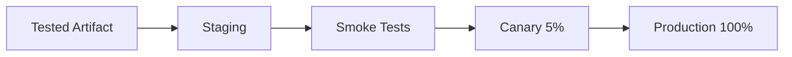
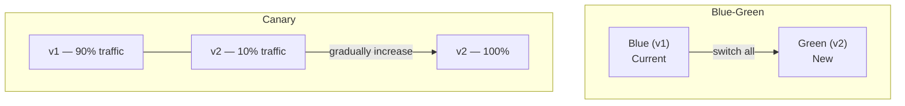
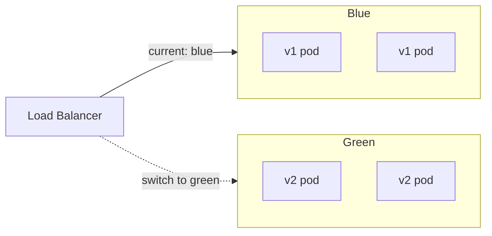

# CD Pipeline

## From Artifact to Production

CI builds and tests. CD takes the tested artifact and deploys it. The deployment pipeline controls how code reaches users.



## Deployment Strategies



### Rolling Update (Default)

Replace old pods with new pods gradually.

```yaml
# Kubernetes rolling update
spec:
  strategy:
    type: RollingUpdate
    rollingUpdate:
      maxUnavailable: 1
      maxSurge: 1
```

Simple. Risk: mixed versions running simultaneously during rollout.

### Blue/Green Deployment

Run two identical environments. Switch traffic instantly.



```yaml
# Kubernetes: switch by updating the selector
apiVersion: v1
kind: Service
metadata:
  name: app-service
spec:
  selector:
    app: app
    slot: green   # change from blue to green
  ports:
    - port: 80
      targetPort: 8080
```

Zero downtime. Instant rollback (switch back). Cost: double the infrastructure during switch.

### Canary Deployment

Route a small percentage of traffic to the new version. Monitor. Gradually increase.

```yaml
# Canary with Istio
apiVersion: networking.istio.io/v1beta1
kind: VirtualService
metadata:
  name: app
spec:
  hosts: [app.example.com]
  http:
    - match:
        - headers:
            x-canary:
              exact: "true"
      route:
        - destination:
            host: app
            subset: canary
          weight: 5
    - route:
        - destination:
            host: app
            subset: stable
          weight: 95
```

Safest strategy. Requires traffic splitting capability and strong monitoring.

## CD Pipeline in GitHub Actions

```yaml
# .github/workflows/deploy.yml
name: Deploy

on:
  push:
    branches: [main]

jobs:
  deploy-staging:
    runs-on: ubuntu-latest
    needs: [ci]  # depends on CI pipeline passing
    environment: staging
    steps:
      - uses: actions/checkout@v4

      - uses: azure/setup-kubectl@v3

      - name: Deploy to staging
        run: |
          kubectl set image deployment/app \
            app=ghcr.io/org/app:${{ github.sha }} \
            --namespace staging
          kubectl rollout status deployment/app \
            --namespace staging --timeout=300s

      - name: Smoke tests
        run: |
          curl -sf https://staging.example.com/health
          curl -sf https://staging.example.com/api/status

  deploy-production:
    runs-on: ubuntu-latest
    needs: deploy-staging
    environment: production
    steps:
      - uses: actions/checkout@v4

      - uses: azure/setup-kubectl@v3

      - name: Deploy to production
        run: |
          kubectl set image deployment/app \
            app=ghcr.io/org/app:${{ github.sha }} \
            --namespace production
          kubectl rollout status deployment/app \
            --namespace production --timeout=300s

      - name: Verify
        run: ./scripts/verify-deployment.sh production
```

The `environment: production` setting adds a manual approval gate in GitHub. Approve to deploy.

## Rollback Strategy

```bash
# Kubernetes: rollback to previous version
kubectl rollout undo deployment/app --namespace production

# Rollback to specific revision
kubectl rollout undo deployment/app --revision=3 --namespace production

# Check rollout history
kubectl rollout history deployment/app --namespace production
```

```yaml
# Keep rollback revisions available
spec:
  revisionHistoryLimit: 5  # keep last 5 ReplicaSets for rollback
```

## Deployment Safety Rules

1. **Never deploy on Friday afternoon** — unless you have full automated rollback and on-call coverage
2. **Always deploy the same artifact** through environments — do not rebuild between staging and production
3. **Require passing CI** before any deployment
4. **Monitor after deploy** — check error rates, latency, and key business metrics for 15 minutes
5. **Have a rollback runbook** — everyone on the team must know how to roll back
