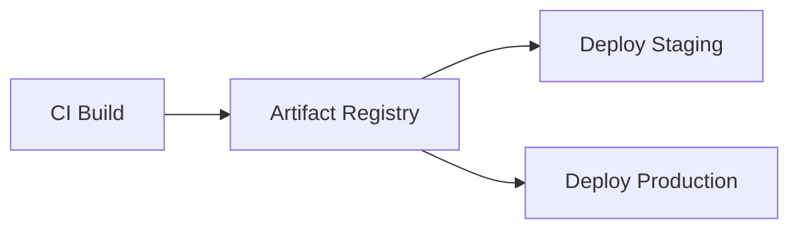

# Artifact Management `[Mid]`

## What Is an Artifact

An artifact is the immutable output of your build pipeline: a container image, a compiled binary, a packaged library. Once built, it moves through environments unchanged.



The same artifact that passes tests in staging is the one deployed to production. Never rebuild between environments.

## Container Registries

```bash
# Tag and push to Docker Hub
docker tag myapp:latest dockerhub-user/myapp:v1.2.3
docker push dockerhub-user/myapp:v1.2.3

# GitHub Container Registry (GHCR)
docker tag myapp:latest ghcr.io/org/myapp:abc1234
docker push ghcr.io/org/myapp:abc1234

# AWS Elastic Container Registry (ECR)
aws ecr get-login-password --region us-east-1 | \
    docker login --username AWS --password-stdin 123456789.dkr.ecr.us-east-1.amazonaws.com
docker tag myapp:latest 123456789.dkr.ecr.us-east-1.amazonaws.com/myapp:abc1234
docker push 123456789.dkr.ecr.us-east-1.amazonaws.com/myapp:abc1234
```

## Versioning Strategy

```bash
# Semantic versioning (semver)
MAJOR.MINOR.PATCH
  1   .  2  .  3

# Tag images with multiple tags for flexibility
docker tag myapp ghcr.io/org/myapp:1.2.3       # exact version
docker tag myapp ghcr.io/org/myapp:1.2          # minor version (latest patch)
docker tag myapp ghcr.io/org/myapp:latest       # convenience tag
docker tag myapp ghcr.io/org/myapp:sha-abc1234  # git commit for traceability
```

```yaml
# Automated tagging in CI
tags: |
  type=semver,pattern={{version}}
  type=semver,pattern={{major}}.{{minor}}
  type=sha,prefix=sha-
  type=raw,value=latest,enable={{is_default_branch}}
```

## Package Registries

For libraries and language-specific packages:

```yaml
# npm package publishing
- name: Publish to npm
  if: startsWith(github.ref, 'refs/tags/v')
  run: npm publish --access public
  env:
    NODE_AUTH_TOKEN: ${{ secrets.NPM_TOKEN }}

# Python package to PyPI
- name: Publish to PyPI
  if: startsWith(github.ref, 'refs/tags/v')
  run: |
    python -m build
    twine upload dist/* --username __token__ --password ${{ secrets.PYPI_TOKEN }}
```

## Registry Cleanup

Registries fill up. Automate cleanup:

```yaml
# ECR lifecycle policy — keep last 30 images
aws ecr put-lifecycle-policy --repository-name myapp --lifecycle-policy-text '{
  "rules": [
    {
      "rulePriority": 1,
      "description": "Keep last 30 images",
      "selection": {
        "tagStatus": "tagged",
        "tagPrefixList": ["sha-"],
        "countType": "imageCountMoreThan",
        "countNumber": 30
      },
      "action": { "type": "expire" }
    },
    {
      "rulePriority": 2,
      "description": "Expire untagged images after 7 days",
      "selection": {
        "tagStatus": "untagged",
        "countType": "sinceImagePushed",
        "countUnit": "days",
        "countNumber": 7
      },
      "action": { "type": "expire" }
    }
  ]
}'
```

## Pulling Artifacts in Deployment

```yaml
# Kubernetes: reference image from registry
apiVersion: apps/v1
kind: Deployment
metadata:
  name: app
spec:
  template:
    spec:
      containers:
        - name: app
          image: ghcr.io/org/myapp:sha-abc1234  # pin to exact SHA
          imagePullPolicy: IfNotPresent
```

Always pin to an exact image tag (SHA), never `latest` in production. `latest` is ambiguous — you cannot tell which version is running.

## Registry Comparison

| Registry | Auth | Best For |
|----------|------|----------|
| Docker Hub | Free for public | Open source |
| GHCR | GitHub token | GitHub users |
| ECR | IAM roles | AWS workloads |
| GCR / Artifact Registry | Service accounts | GCP workloads |
| ACR | Azure AD | Azure workloads |
