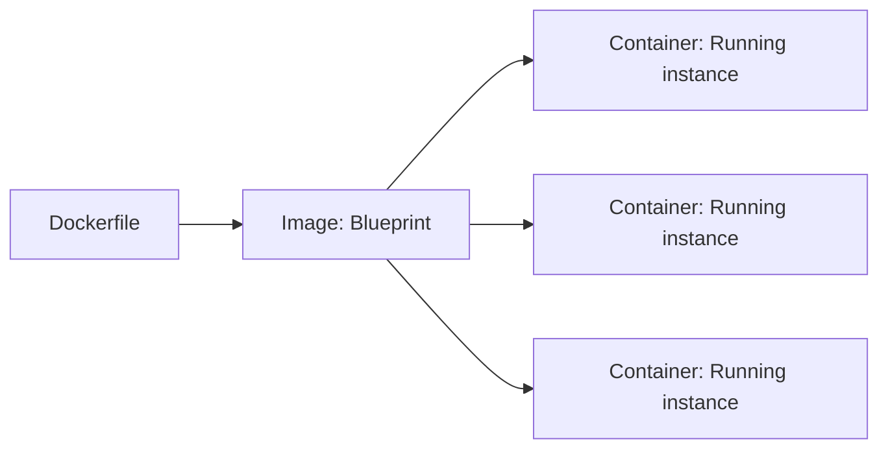

# Docker Fundamentals `[Entry]`

## Why Containers

"It works on my machine" is a real problem. Containers solve it by packaging the application with its entire runtime: OS libraries, dependencies, configuration. A container runs identically on every host.



**Image** — read-only template with your app and its dependencies
**Container** — running instance of an image
**Dockerfile** — instructions to build an image

## Dockerfile Step by Step

```dockerfile
# Stage 1: Build
FROM node:20-alpine AS builder

WORKDIR /app

COPY package.json package-lock.json ./
RUN npm ci --ignore-scripts

COPY . .
RUN npm run build

# Stage 2: Production
FROM node:20-alpine

WORKDIR /app

RUN addgroup -S appgroup && adduser -S appuser -G appgroup

COPY --from=builder /app/dist ./dist
COPY --from=builder /app/node_modules ./node_modules
COPY --from=builder /app/package.json ./

USER appuser

EXPOSE 8080

HEALTHCHECK --interval=30s --timeout=3s \
    CMD wget -qO- http://localhost:8080/health || exit 1

CMD ["node", "dist/server.js"]
```

**Line by line:**

| Instruction | Purpose |
|-------------|---------|
| `FROM node:20-alpine AS builder` | Use Node.js on Alpine Linux. Name the stage "builder". |
| `WORKDIR /app` | Set working directory inside the container |
| `COPY package*.json ./` | Copy dependency manifests first (layer caching) |
| `RUN npm ci` | Install dependencies (cached if package files unchanged) |
| `COPY . .` | Copy source code |
| `RUN npm run build` | Compile the application |
| `FROM node:20-alpine` | Second stage — clean image without build tools |
| `RUN addgroup/adduser` | Create non-root user |
| `COPY --from=builder` | Copy only build output from builder stage |
| `USER appuser` | Run as non-root |
| `HEALTHCHECK` | Let Docker know if the container is healthy |
| `CMD` | Default command when container starts |

## Layer Caching

Docker builds images in layers. Each `RUN`, `COPY`, `ADD` creates a layer. If a layer hasn't changed, Docker reuses the cache.

```dockerfile
# BAD — source changes invalidate npm install cache
COPY . .
RUN npm install

# GOOD — npm install only reruns when package.json changes
COPY package.json package-lock.json ./
RUN npm ci
COPY . .
```

Order instructions from least to most frequently changed.

## Build and Run

```bash
# Build image
docker build -t myapp:v1.2.3 .

# Run container
docker run -d \
    --name myapp \
    -p 8080:8080 \
    -e DATABASE_URL=postgres://db:5432/app \
    -e NODE_ENV=production \
    myapp:v1.2.3

# Check running containers
docker ps

# View logs
docker logs -f myapp

# Execute command inside container
docker exec -it myapp sh

# Stop and remove
docker stop myapp && docker rm myapp

# Inspect image layers
docker history myapp:v1.2.3

# Image size
docker images myapp
```

## Multi-Stage Builds

Multi-stage builds produce small images by separating build dependencies from runtime:

```dockerfile
# Build stage: ~1GB (compilers, dev tools, source code)
FROM golang:1.22 AS builder
WORKDIR /app
COPY . .
RUN CGO_ENABLED=0 go build -o server .

# Final stage: ~10MB (binary only)
FROM scratch
COPY --from=builder /app/server /server
ENTRYPOINT ["/server"]
```

A Go binary in a `scratch` image can be under 10MB. No shell, no package manager, minimal attack surface.

## Common Mistakes

- Running as root (security risk)
- Not using `.dockerignore` (copying `node_modules`, `.git`, secrets)
- Installing dev dependencies in production image
- Using `latest` tag in production
- Not pinning base image versions (`node:20.11-alpine` not `node:alpine`)

```bash
# .dockerignore
node_modules
.git
.env
*.md
coverage
.docker
```
