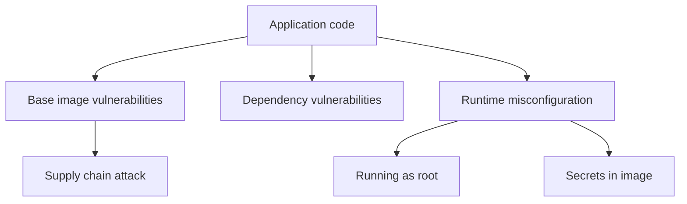

# Container Security

## Threat Model

Containers can be compromised at multiple levels:



## Use Minimal Base Images

```dockerfile
# BAD — full OS, ~120MB, shell, package manager, attack surface
FROM ubuntu:22.04

# BETTER — distroless, ~20MB, no shell, no package manager
FROM gcr.io/distroless/nodejs20-debian12

# GOOD — Alpine, ~5MB, minimal tools
FROM node:20-alpine

# BEST — scratch (for compiled binaries)
FROM scratch
COPY --from=builder /app/server /server
```

Smaller images = fewer vulnerabilities = smaller attack surface = faster pulls.

## Run as Non-Root

```dockerfile
# Create a dedicated user
RUN addgroup -S appgroup && adduser -S appuser -G appgroup

# Set ownership
COPY --chown=appuser:appgroup . /app

# Switch to non-root
USER appuser
```

```yaml
# Kubernetes enforcement
apiVersion: v1
kind: Pod
metadata:
  name: app
spec:
  securityContext:
    runAsNonRoot: true
    runAsUser: 1000
    fsGroup: 2000
  containers:
    - name: app
      image: myapp:latest
      securityContext:
        allowPrivilegeEscalation: false
        readOnlyRootFilesystem: true
        capabilities:
          drop: ["ALL"]
```

## No Secrets in Images

```dockerfile
# NEVER DO THIS
ENV DATABASE_PASSWORD=supersecret
COPY .env /app/.env

# DO THIS — pass at runtime
# docker run -e DATABASE_PASSWORD=secret myapp
```

```yaml
# Use Kubernetes Secrets or external secret managers
apiVersion: v1
kind: Secret
metadata:
  name: db-credentials
type: Opaque
data:
  password: <base64-encoded-value>
---
apiVersion: apps/v1
kind: Deployment
spec:
  template:
    spec:
      containers:
        - name: app
          env:
            - name: DATABASE_PASSWORD
              valueFrom:
                secretKeyRef:
                  name: db-credentials
                  key: password
```

## Scan for Vulnerabilities

```bash
# Trivy — scan image for CVEs
trivy image myapp:latest

# Scan and fail CI on critical vulnerabilities
trivy image --exit-code 1 --severity CRITICAL,HIGH myapp:latest

# Scan Dockerfile for misconfigurations
trivy config Dockerfile
```

```yaml
# GitHub Actions: scan in CI
- name: Scan image
  uses: aquasecurity/trivy-action@master
  with:
    image-ref: "ghcr.io/org/myapp:${{ github.sha }}"
    severity: "CRITICAL,HIGH"
    exit-code: "1"
```

## Supply Chain Security

```dockerfile
# Pin base image digest (not just tag)
FROM node:20.11-alpine@sha256:abc123def456...

# Tags can be overwritten. Digests cannot.
```

```bash
# Get image digest
docker inspect --format='{{index .RepoDigests 0}}' node:20-alpine
```

```yaml
# cosign — verify image signature
- name: Verify image signature
  run: |
    cosign verify \
      --certificate-identity=ci@myorg.iam.gserviceaccount.com \
      --certificate-oidc-issuer=https://token.actions.githubusercontent.com \
      ghcr.io/org/myapp@sha256:abc123...
```

## Read-Only Root Filesystem

```dockerfile
# Write only to a tmpfs or emptyDir
USER appuser
```

```yaml
# Kubernetes
securityContext:
  readOnlyRootFilesystem: true
volumeMounts:
  - name: tmp
    mountPath: /tmp
volumes:
  - name: tmp
    emptyDir: {}
```

## Security Checklist

```yaml
container_security:
  image:
    - use minimal base (distroless, alpine, scratch)
    - pin image by digest
    - scan for CVEs in CI
    - use multi-stage builds (no build tools in final image)
  runtime:
    - run as non-root user
    - drop all Linux capabilities
    - read-only root filesystem
    - no privileged containers
  secrets:
    - never in Dockerfile or image
    - use Kubernetes Secrets or vault
    - inject at runtime via env or volume
  supply_chain:
    - sign images (cosign, notary)
    - verify signatures before deploy
    - pin dependency versions
```
