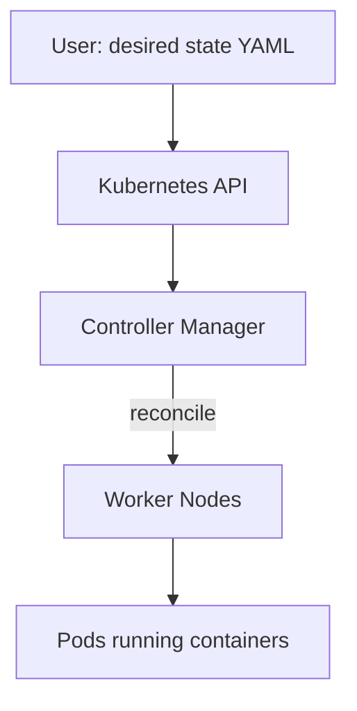
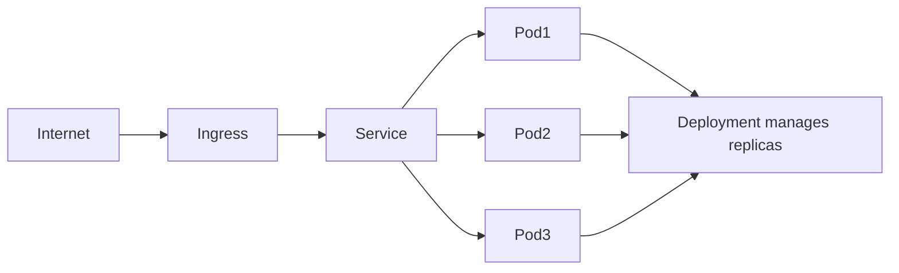

# Kubernetes Concepts

## Why Kubernetes

Containers are easy to run. Managing hundreds of them is not. Kubernetes automates deployment, scaling, and management of containerized applications.



**Mental model:** You declare what you want (3 replicas of my app). Kubernetes continuously reconciles actual state to match desired state. If a pod dies, Kubernetes replaces it.

## Core Objects

### Pod

Smallest unit. One or more containers sharing network and storage.

```yaml
apiVersion: v1
kind: Pod
metadata:
  name: app
spec:
  containers:
    - name: app
      image: ghcr.io/org/myapp:sha-abc1234
      ports:
        - containerPort: 8080
      resources:
        requests:
          memory: "128Mi"
          cpu: "100m"
        limits:
          memory: "256Mi"
          cpu: "500m"
```

You rarely create Pods directly. Use Deployments.

### Deployment

Manages a set of Pods. Handles rolling updates, rollbacks, and self-healing.

```yaml
apiVersion: apps/v1
kind: Deployment
metadata:
  name: app
spec:
  replicas: 3
  selector:
    matchLabels:
      app: app
  template:
    metadata:
      labels:
        app: app
    spec:
      containers:
        - name: app
          image: ghcr.io/org/myapp:sha-abc1234
          ports:
            - containerPort: 8080
          readinessProbe:
            httpGet:
              path: /health
              port: 8080
            initialDelaySeconds: 5
            periodSeconds: 10
          livenessProbe:
            httpGet:
              path: /health
              port: 8080
            initialDelaySeconds: 15
            periodSeconds: 20
```

If you update the image tag, Kubernetes performs a rolling update: creates new pods, waits for readiness, removes old pods.

### Service

Stable network endpoint for a set of Pods. Pods have ephemeral IPs. Services provide a fixed address.

```yaml
apiVersion: v1
kind: Service
metadata:
  name: app-service
spec:
  selector:
    app: app          # routes to pods with this label
  ports:
    - port: 80
      targetPort: 8080
  type: ClusterIP     # internal only
```

Other services reach your app at `app-service:80`. The Service load-balances across matching Pods.

### Ingress

Exposes HTTP routes from outside the cluster to Services.

```yaml
apiVersion: networking.k8s.io/v1
kind: Ingress
metadata:
  name: app-ingress
spec:
  rules:
    - host: app.example.com
      http:
        paths:
          - path: /
            pathType: Prefix
            backend:
              service:
                name: app-service
                port:
                  number: 80
  tls:
    - hosts:
        - app.example.com
      secretName: app-tls
```

## How It Fits Together

> 🖼️ **[IMAGE_PLACEHOLDER]** — Kubernetes traffic flow Ingress Service Pod Deployment



Traffic flow: Internet -> Ingress (host/path routing) -> Service (load balancing) -> Pods (running containers)

## Reconciler Loop

> 🖼️ **[IMAGE_PLACEHOLDER]** — Kubernetes reconciler loop desired state actual state controller

Kubernetes is a control plane of reconciler loops:

1. You submit desired state (YAML) to the API server
2. Controllers watch for changes
3. Controllers take action to make actual state match desired state
4. If something drifts (pod crashes, node fails), controllers fix it

This is why Kubernetes is **declarative** — you say what you want, not how to do it.

## Key Properties

| Property | How K8s Provides It |
|----------|---------------------|
| Self-healing | Restarts failed pods, replaces evicted pods |
| Scaling | `kubectl scale deployment app --replicas=10` |
| Rolling updates | Gradual pod replacement with health checks |
| Service discovery | DNS-based (`app-service.namespace.svc.cluster.local`) |
| Load balancing | Services distribute traffic across pods |
| Secret management | Built-in Secret objects (encrypt at rest with etcd encryption) |
