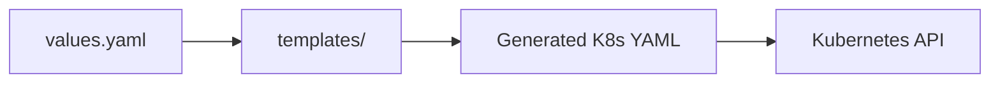

# Helm

## What Helm Solves

Raw Kubernetes YAML is repetitive. Deploying the same app to dev, staging, and production means maintaining three nearly-identical YAML files. Helm templates this away.



Helm is a package manager for Kubernetes. It bundles Kubernetes manifests into **Charts** — parameterized, versioned, shareable templates.

## Chart Structure

```
myapp-chart/
  Chart.yaml          # chart metadata (name, version, dependencies)
  values.yaml         # default configuration values
  charts/             # dependent charts (dependencies)
  templates/
    deployment.yaml   # deployment template
    service.yaml      # service template
    ingress.yaml      # ingress template
    configmap.yaml    # configmap template
    _helpers.tpl      # shared template helpers
```

## Chart.yaml

```yaml
apiVersion: v2
name: myapp
description: Application deployment chart
type: application
version: 1.2.3          # chart version (semver)
appVersion: "2.1.0"     # application version
dependencies:
  - name: postgresql
    version: "15.0.0"
    repository: "https://charts.bitnami.com/bitnami"
    condition: postgresql.enabled
```

## values.yaml

```yaml
replicaCount: 3

image:
  repository: ghcr.io/org/myapp
  pullPolicy: IfNotPresent
  tag: ""

service:
  type: ClusterIP
  port: 80

ingress:
  enabled: true
  className: nginx
  hosts:
    - host: app.example.com
      paths:
        - path: /
          pathType: Prefix

resources:
  requests:
    memory: "128Mi"
    cpu: "100m"
  limits:
    memory: "256Mi"
    cpu: "500m"

autoscaling:
  enabled: true
  minReplicas: 3
  maxReplicas: 10
  targetCPUUtilizationPercentage: 80

postgresql:
  enabled: true
  auth:
    database: appdb
    username: appuser
    password: ""         # override in production

env:
  LOG_LEVEL: info
  NODE_ENV: production
```

## Templates

```yaml
# templates/deployment.yaml
apiVersion: apps/v1
kind: Deployment
metadata:
  name: {{ include "myapp.fullname" . }}
  labels:
    {{- include "myapp.labels" . | nindent 4 }}
spec:
  replicas: {{ .Values.replicaCount }}
  selector:
    matchLabels:
      {{- include "myapp.selectorLabels" . | nindent 6 }}
  template:
    metadata:
      labels:
        {{- include "myapp.selectorLabels" . | nindent 8 }}
    spec:
      containers:
        - name: {{ .Chart.Name }}
          image: "{{ .Values.image.repository }}:{{ .Values.image.tag | default .Chart.AppVersion }}"
          ports:
            - containerPort: 8080
          {{- if .Values.resources }}
          resources:
            {{- toYaml .Values.resources | nindent 12 }}
          {{- end }}
          {{- if .Values.env }}
          env:
            {{- range $key, $value := .Values.env }}
            - name: {{ $key }}
              value: {{ $value | quote }}
            {{- end }}
          {{- end }}
```

## Helm Commands

```bash
# Install a release
helm install myapp ./myapp-chart -n production

# Upgrade (or install if not exists)
helm upgrade --install myapp ./myapp-chart -n production

# Override values per environment
helm upgrade --install myapp ./myapp-chart \
    -n production \
    -f values-production.yaml

# List releases
helm list -n production

# Check what will change (dry run)
helm upgrade --install myapp ./myapp-chart \
    -n production \
    -f values-production.yaml \
    --dry-run --debug

# Rollback to previous release
helm rollback myapp 2 -n production

# Uninstall
helm uninstall myapp -n production

# Template locally (no cluster needed)
helm template myapp ./myapp-chart -f values-production.yaml > rendered.yaml
```

## Environment-Specific Values

```yaml
# values-staging.yaml
replicaCount: 1
ingress:
  hosts:
    - host: staging.example.com
resources:
  requests:
    memory: "64Mi"
    cpu: "50m"

# values-production.yaml
replicaCount: 3
ingress:
  hosts:
    - host: app.example.com
resources:
  requests:
    memory: "256Mi"
    cpu: "200m"
autoscaling:
  enabled: true
  maxReplicas: 20
```

Same chart, different configuration. One source of truth for the deployment structure.

## Why Helm

| Without Helm | With Helm |
|-------------|-----------|
| 15 raw YAML files per environment | 1 chart + N value files |
| Copy/paste manifests across environments | Template + override |
| Manual dependency management | Chart dependencies |
| No versioning of deployment config | Chart versioning (semver) |
| Hard to rollback | `helm rollback` |
| Cannot share deployment patterns | Publish charts to repositories |

Helm is not the only option (Kustomize is an alternative). But Helm's templating and chart ecosystem make it the most widely adopted.
