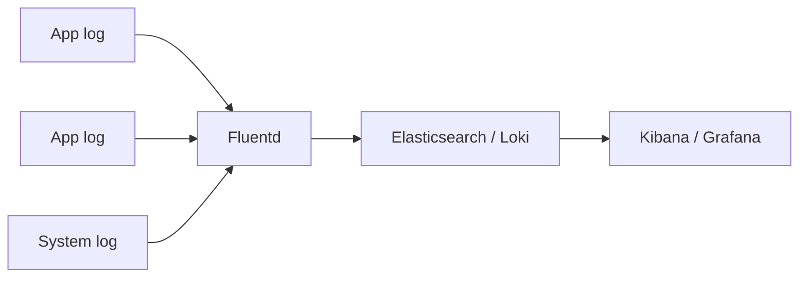

# Logging `[Entry]`

## The Problem

Your application runs on 20 servers. Something breaks. You SSH into each server and `grep` logs? That does not scale. You need centralized logging.



**Log shipper** — agent on every machine collecting logs (Fluentd, Fluent Bit, Filebeat, Promtail)
**Storage** — central log store (Elasticsearch, Loki)
**Query UI** — search and visualize logs (Kibana, Grafana)

## Structured Logging

Plain text logs are hard to parse and search. Use structured (JSON) logging:

```json
{"timestamp":"2025-06-08T10:15:30Z","level":"ERROR","service":"api","trace_id":"abc123","message":"Database connection failed","error":"connection refused","host":"10.0.0.5"}
```

```json
{"timestamp":"2025-06-08T10:15:31Z","level":"INFO","service":"api","trace_id":"abc123","method":"GET","path":"/users","status":200,"duration_ms":45}
```

Why structured:

| Unstructured | Structured |
|-------------|-----------|
| Hard to filter by field | Query by any field: `level=ERROR AND service=api` |
| No consistent format | Machine-parseable JSON |
| Cannot aggregate | Count errors per service, avg duration |
| Trace IDs buried in text | Correlate requests across services |

## Log Levels

```yaml
levels (use intentionally):
  ERROR:  something failed, needs attention
  WARN:   unexpected but recoverable (deprecated API call, retry succeeded)
  INFO:   business events (user signed up, order placed)
  DEBUG:  development detail (query parameters, cache hit/miss)
  TRACE:  very verbose (full request/response bodies)

in_production:
  log_level: INFO
  never: DEBUG or TRACE (noise and performance cost)
```

## Querying Logs

```bash
# Grafana Loki — LogQL

# All logs from api service
{service="api"}

# Error logs from api in last hour
{service="api"} |= "level=ERROR"

# Filter by trace ID (correlate across services)
{service=~"api|worker"} |= "trace_id=abc123"

# Count errors per minute
sum(rate({service="api"} |= "level=ERROR" [5m])) by (level)
```

```
# Elasticsearch / Kibana — KQL

level: ERROR AND service: "api"
trace.id: "abc123"
@timestamp >= "2025-06-08" AND message: "timeout"
```

## Correlation with Trace IDs

```yaml
# Every request gets a unique trace ID
# Pass it through all services in the call chain

request_flow:
  gateway:
    generates_trace_id: true
    log: "trace_id=abc123 path=/orders method=POST"
  api:
    receives_trace_id: via_header
    log: "trace_id=abc123 processing order"
  database:
    receives_trace_id: via_context
    log: "trace_id=abc123 query=INSERT orders duration=12ms"

# Now search: trace_id=abc123
# See the full request journey across all services
```

## Log Retention

```yaml
# Common retention policies
hot_tier:    # last 7 days, fast SSD
    retention: 7d
    searchable: true

warm_tier:   # 7-30 days, slower storage
    retention: 30d
    searchable: true

cold_tier:   # 30-365 days, archive
    retention: 365d
    searchable: on_demand

# Never keep everything forever. Logs are expensive.
```

## What to Log, What Not to Log

```yaml
log:
  - request method, path, status code
  - response duration
  - errors with stack traces
  - business events (user actions)
  - trace IDs for correlation

do_not_log:
  - passwords, tokens, API keys
  - full request bodies (PII)
  - health check requests (noise)
  - every debug statement in production
```
