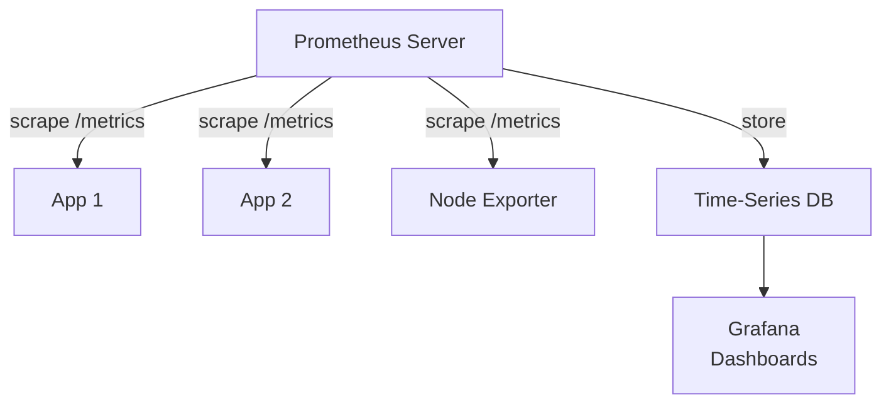
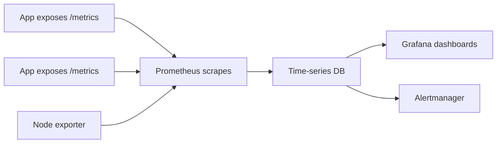
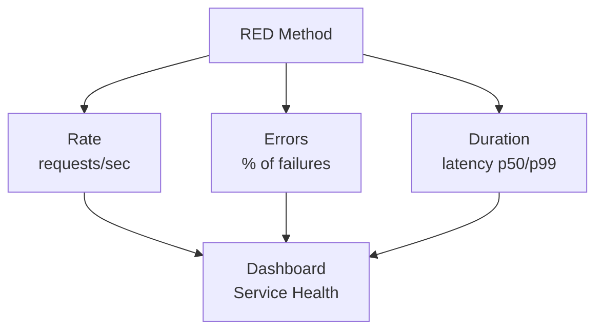

# Metrics

## Why Metrics

Logs tell you what happened. Metrics tell you how the system is performing right now and how it performed over time. Metrics enable dashboards, alerting, and capacity planning.

## Prometheus Mental Model





Prometheus is **pull-based**. It scrapes targets at regular intervals. Targets expose a `/metrics` endpoint.

## Instrumenting Your Application

```yaml
# Expose metrics in your app
# Prometheus client libraries available for all languages

# Example metrics endpoint output (curl localhost:8080/metrics)
# TYPE http_requests_total counter
http_requests_total{method="GET",path="/users",status="200"} 15423
http_requests_total{method="GET",path="/users",status="500"} 12
http_requests_total{method="POST",path="/orders",status="201"} 892

# TYPE http_request_duration_seconds histogram
http_request_duration_seconds_bucket{le="0.05"} 12000
http_request_duration_seconds_bucket{le="0.1"} 14500
http_request_duration_seconds_bucket{le="0.5"} 16200
http_request_duration_seconds_bucket{le="+Inf"} 16327
http_request_duration_seconds_sum 2345.6
http_request_duration_seconds_count 16327
```

**Metric types:**

| Type | Use For | Example |
|------|---------|---------|
| Counter | Cumulative count (only goes up) | Total requests, total errors |
| Gauge | Point-in-time value (can go up or down) | Current connections, queue depth |
| Histogram | Distribution of values | Request duration, response size |
| Summary | Quantiles (client-side) | Precomputed percentiles |

## Prometheus Configuration

```yaml
# prometheus.yml
global:
  scrape_interval: 15s
  evaluation_interval: 15s

scrape_configs:
  - job_name: "app"
    metrics_path: /metrics
    static_configs:
      - targets:
          - "app:8080"

  - job_name: "kubernetes-pods"
    kubernetes_sd_configs:
      - role: pod
    relabel_configs:
      - source_labels: [__meta_kubernetes_pod_annotation_prometheus_io_scrape]
        action: keep
        regex: true
```

In Kubernetes, pods with the annotation `prometheus.io/scrape: "true"` are automatically discovered.

## PromQL — Query Language

```promql
# Request rate (requests per second)
rate(http_requests_total[5m])

# Error rate (5xx as percentage of all requests)
sum(rate(http_requests_total{status=~"5.."}[5m]))
/
sum(rate(http_requests_total[5m]))
* 100

# 95th percentile latency
histogram_quantile(0.95,
  sum(rate(http_request_duration_seconds_bucket[5m]))
  by (le)
)

# Top 5 endpoints by request rate
topk(5, sum by (path) (rate(http_requests_total[5m])))
```

## The RED Method



For every user-facing service, track these three:

| Metric | What It Measures | Alert Threshold |
|--------|-----------------|-----------------|
| **R**ate | Requests per second | Sudden drop or spike |
| **E**rrors | Failed requests per second | > 1% error rate |
| **D**uration | Request latency (p50, p95, p99) | p99 > 2s |

```yaml
# RED dashboard for a service
panels:
  - title: "Request Rate"
    query: sum(rate(http_requests_total{service="api"}[5m]))
    unit: "req/s"

  - title: "Error Rate"
    query: |
      sum(rate(http_requests_total{service="api",status=~"5.."}[5m]))
      /
      sum(rate(http_requests_total{service="api"}[5m]))

  - title: "Latency p50/p95/p99"
    query: |
      histogram_quantile(0.99,
        sum(rate(http_request_duration_seconds_bucket{service="api"}[5m])) by (le)
      )
```

## Grafana Dashboards

```yaml
# Grafana provisioning — automatic dashboard setup
apiVersion: 1
providers:
  - name: default
    orgId: 1
    folder: ""
    type: file
    options:
      path: /var/lib/grafana/dashboards
```

Dashboard design principles:
- One dashboard per service
- RED metrics at the top
- Resource metrics (CPU, memory, disk) below
- Always include time range selector
- Link to logs from metric panels (trace ID correlation)

## Capacity Planning

```promql
# Memory usage trend (predict when you'll run out)
predict_linear(node_memory_MemAvailable_bytes[1d], 7*24*3600)

# Disk fill rate
deriv(node_filesystem_avail_bytes[1d]) * -1
```
