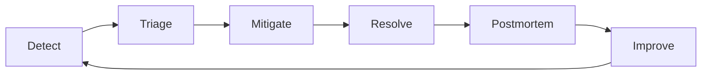

# Incident Management

## Incidents Will Happen

No amount of automation prevents all incidents. What separates high-performing teams is how fast they detect, respond, and learn.



## On-Call

```yaml
# On-call expectations
schedule:
  rotation: weekly
  team_size: 4-6 engineers
  primary: responds to pages within 5 minutes
  secondary: backup if primary unavailable

responsibilities:
  - acknowledge pages within 5 minutes
  - mitigate the incident (stop the bleeding)
  - communicate status to stakeholders
  - write a postmortem within 48 hours

not_responsible_for:
  - finding root cause during the incident
  - perfect fix during the incident
  - preventing all future incidents
```

### On-Call Rules

1. **Mitigate first, fix later.** Roll back, restart, scale up — whatever stops user impact. Root cause analysis happens after.
2. **Communicate.** Stakeholders need to know there's an issue, what's affected, and when it'll be fixed.
3. **Page freely.** If you're unsure whether to page, page. False alarms are cheap. Delayed pages are expensive.

## Incident Severity

| Severity | Impact | Examples |
|----------|--------|---------|
| SEV1 | Total outage, data loss risk | Site down, payment processing failed |
| SEV2 | Major degradation | 50% of users affected, critical feature broken |
| SEV3 | Minor degradation | Non-critical feature slow, cosmetic issues |
| SEV4 | No user impact | Monitoring gap, capacity trending low |

SEV1 and SEV2: page on-call immediately.
SEV3 and SEV4: handle during business hours.

## Communication During Incidents

```markdown
# Incident Slack channel: #incident-2025-06-08-api

10:15 [oncall] SEV2: API returning 500 errors for /orders endpoint
10:16 [oncall] Acknowledged. Investigating.
10:22 [oncall] Root cause: database connection pool exhausted after deploy v2.3.1
10:23 [oncall] Mitigating: rolling back to v2.3.0
10:28 [oncall] Rollback complete. Error rate returning to normal.
10:35 [oncall] Incident resolved. Error rate at baseline. Postmortem to follow.

# Stakeholder update (sent to #engineering)
INCIDENT UPDATE: API /orders endpoint returning 500 errors.
Start: 10:15 UTC
Status: Resolved at 10:28 UTC
Impact: ~200 failed orders over 13 minutes
Action: Rolled back deploy v2.3.1. Postmortem pending.
```

## Postmortems

A postmortem is a blameless analysis of what happened, why, and how to prevent recurrence.

```markdown
# Postmortem: API 500 Errors on /orders

## Summary
On 2025-06-08, deploy v2.3.1 introduced a database connection leak
that exhausted the connection pool within 13 minutes of deployment.

## Timeline (all times UTC)
- 10:00 — Deploy v2.3.1 to production
- 10:15 — Alert fires: APIHighErrorRate
- 10:16 — On-call acknowledges
- 10:22 — Connection pool exhaustion identified in logs
- 10:23 — Rollback initiated to v2.3.0
- 10:28 — Error rate returns to baseline

## Root Cause
The new order processing code opened a database transaction but
did not close it on error paths. Under load, the connection pool
(100 connections) exhausted in ~13 minutes.

## Contributing Factors
- No connection pool metrics were monitored
- Integration tests did not simulate concurrent order failures
- No staged rollout (deployed directly to 100% of production)

## Action Items
1. Add connection pool metrics to dashboard (owner: backend, due: 1 week)
2. Add integration test for concurrent order failures (owner: backend, due: 1 week)
3. Implement canary deployment for 5% traffic first (owner: platform, due: 2 weeks)
4. Add connection leak detection in development (owner: backend, due: 1 week)
```

## Blameless Culture

```yaml
# Principles
blameless:
  - focus on the system, not the person
  - "what failed" not "who failed"
  - human error is a symptom of system problems
  - the person who pushed the broken code is the victim, not the cause

anti_patterns:
  - naming individuals in postmortems
  - punishment for causing incidents
  - "be more careful next time" as an action item
  - skipping postmortems for "minor" incidents
```

The person who deployed the bug did not wake up and decide to break production. The system allowed it. Fix the system.

## Incident Metrics

| Metric | Target | Why |
|--------|--------|-----|
| Time to Detect (TTD) | < 5 min | How fast monitoring catches issues |
| Time to Acknowledge (TTA) | < 5 min | How fast on-call responds |
| Time to Mitigate (TTM) | < 30 min | How fast user impact stops |
| Time to Resolve (TTR) | < 2 hours | How fast the fix is in place |
| Postmortems completed | 100% of SEV1/SEV2 | Every major incident produces learning |
